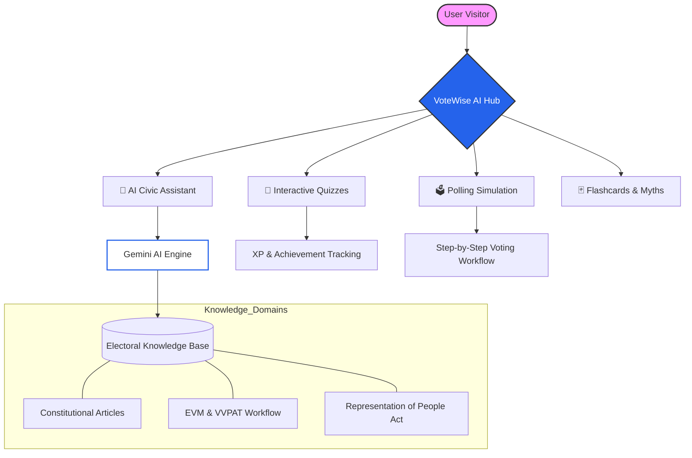

<h1>🗳️ VoteWise AI</h1>
<h3>AI-Powered Indian Election Learning Platform 🇮🇳</h3>

  
  &nbsp;&nbsp;
  

  VoteWise AI is an interactive civic education platform designed to help users understand the Indian election system in a simple, engaging, and educational way. 
  The platform combines AI-powered conversations, quizzes, flashcards, polling simulations, and multilingual support to improve election literacy and democratic awareness in India.

---

# 📖 About the Project

**VoteWise AI** is a comprehensive, gamified civic education platform tailored for the Indian democratic landscape. It bridges the gap between complex constitutional laws and citizen understanding by providing an interactive, AI-driven learning experience. 

Whether you're a first-time voter curious about the polling process or a student preparing for competitive exams, VoteWise AI offers personalized learning paths to master Indian electoral literacy. Our mission is to democratize election education through technology, making it accessible, engaging, and politically neutral.

## 🗺️ Platform Workflow

Below is a high-level visualization of how the platform delivers educational value through its various modules:

---

# ✨ Features

## 🤖 AI Civic Assistant
Ask questions about:

* Indian elections
* Election Commission of India (ECI)
* Lok Sabha & Rajya Sabha
* EVM & VVPAT
* NOTA
* Voting process
* Election laws & constitutional articles
* Political party recognition
* First-time voter guidance

---
## 🧠 Interactive Quiz System
* MCQ-based quizzes
* Beginner, Student & Exam modes
* Score tracking
* XP & streak system
* Explanations after answers
---
## 🃏 Flashcards
Learn important concepts quickly:

* Constitutional Articles
* Election laws
* Amendments
* EVM & VVPAT
* Voting terminology
---
## 🗳️ Polling Day Simulation
Experience the Indian voting process step-by-step:
1. Voter verification
2. Booth entry
3. EVM voting
4. VVPAT confirmation
5. Ink marking process
---
## 🌐 Multilingual Support

Supports:

* English
* Hindi
* Telugu
* Tamil
More Indian languages planned.
---
## 🎯 Learning Modes

Choose how you want to learn:
* Simple
* Student
* Exam
* First Voter
---
## 📚 Educational Topics Covered

* Election Commission of India
* Constitutional Articles 324–329
* Representation of the People Act
* EVM & VVPAT
* NOTA
* Model Code of Conduct
* Anti-defection law
* Lok Sabha & Rajya Sabha elections
* Delimitation
* Election myths & facts
* Voter registration process

---

# 🛠️ Tech Stack

## Frontend

* HTML5 (Semantic)
* CSS3 (Glassmorphism, Dark Mode)
* JavaScript (ES6+, React 19)
* **Google Gemini API** (AI Civic Assistant)
* **Vitest** (Automated Testing)

## Future Enhancements

* React / Next.js
* Firebase (Persistence & Auth)
* Voice assistant support
* Real-time Election Result API Integration

---

# 🚀 Future Roadmap

Planned improvements:

* Dark mode
* Advanced polling simulations
* Gamification badges & Leaderboards
* AI-generated mock tests
* Daily civic facts
* Mobile app version

---

# ⚖️ Political Neutrality

VoteWise AI is an educational civic platform and does not support or oppose any political party, candidate, or ideology.

The platform is designed purely for civic awareness, election literacy, and democratic education.

---

# 📌 Disclaimer

This project is for educational purposes only.

Users should verify official election-related information through:

* https://eci.gov.in
* https://voters.eci.gov.in

Voter Helpline: **1950**

---
# 👨‍💻 Author
Developed by **Vikas Gupta**
GitHub: https://github.com/vikasgupta37
---
# ⭐ Vision
Our goal is to make Indian election education:

* interactive
* accessible
* multilingual
* beginner-friendly
* engaging for students and first-time voters

VoteWise AI aims to promote informed democratic participation through technology and civic learning.
